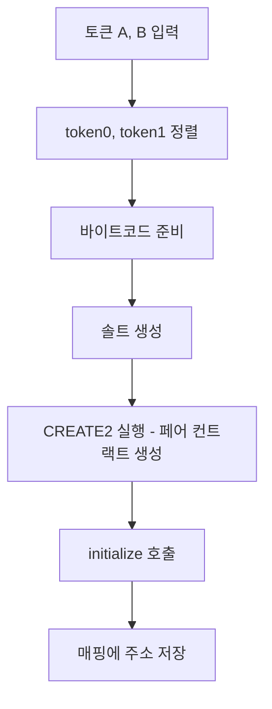

# uniswap v2 core contract 분석

uniswap v2 core 에는 크게 factory, pair 2개의 컨트랙트가 있다.

이 컨트랙트들을 코드를 까보며 보려고 한다.

# 1. Factory

factory 에서는 흔히 LP 라고 부르는 pair를 만든다.

그리고 프로토콜 수수료를 받을 주소를 저장하고 있는다.

눈여겨볼 함수는 createPair 이다.

프로세스는 다음과 같다.



다음은 코드이다.

```solidity
function createPair(address tokenA, address tokenB) external returns (address pair) {
    require(tokenA != tokenB, 'UniswapV2: IDENTICAL_ADDRESSES');
    (address token0, address token1) = tokenA < tokenB ? (tokenA, tokenB) : (tokenB, tokenA);
    require(token0 != address(0), 'UniswapV2: ZERO_ADDRESS');
    require(getPair[token0][token1] == address(0), 'UniswapV2: PAIR_EXISTS'); // single check is sufficient
    bytes memory bytecode = type(UniswapV2Pair).creationCode;
    bytes32 salt = keccak256(abi.encodePacked(token0, token1));
    assembly {
        pair := create2(0, add(bytecode, 32), mload(bytecode), salt)
    }
    IUniswapV2Pair(pair).initialize(token0, token1);
    getPair[token0][token1] = pair;
    getPair[token1][token0] = pair; // populate mapping in the reverse direction
    allPairs.push(pair);
    emit PairCreated(token0, token1, pair, allPairs.length);
}
```

상세히 라인별로 코드를 따라가 본다.

## (1) token0, token1 정렬

```solidity
(address token0, address token1) = tokenA < tokenB ? (tokenA, tokenB) : (tokenB, tokenA);
```

2개의 토큰 address를 받아서 pair를 만드는 것이다.

pair의 중복을 막기위해 token을 정렬한다.

다음은 실제 pair를 배포하는 코드이다

## (2) 바이트코드 준비

```solidity
bytes memory bytecode = type(UniswapV2Pair).creationCode;
```

먼저 pair의 배포에 필요한 바이트 코드의 메모리 주소를 가져온다.

바이트코드의 첫 32바이트에는 길이를 저장하고 나머지에 실제 데이터를 저장한다고 한다.

## (3) 솔트 생성

```solidity
bytes32 salt = keccak256(abi.encodePacked(token0, token1));
```

먼저 [solidity 공식문서에서 abi.encodePacked](https://docs.soliditylang.org/en/v0.8.30/abi-spec.html)에 대해 설명을 봤다.

abi.encode 와 abi.encodePacked 두가지가 있는데 abi.encodePacked는 압축으로 32바이트 미만 타입들은 패딩값을 안넣는다고 한다. 하지만 값이 배열일때는 패딩을 유지한다고 한다.

keccak256 함수는 solidity에서의 기본 해시함수이다. sha256등 [다른 해시함수들](https://www.geeksforgeeks.org/solidity/what-is-hashing-in-solidity/)보다 비교적 가스비가 덜든다고 한다.

```solidity
// 배열 요소는 32바이트로 패딩
uint16[2] memory arr = [uint16(0x12), uint16(0x34)];
abi.encodePacked(arr) = 0x00120034
```

salt를 만들어서 create2 할 준비를 한다.

salt에 정렬된 token 주소들을 넣기 때문에 같은 token들을 넣으면 같은 값이 나온다.

## (4) CREATE2 실행

```solidity
assembly {
    pair := create2(0, add(bytecode, 32), mload(bytecode), salt)
}
```

[solidity 공식문서](https://solidity-kr.readthedocs.io/ko/latest/assembly.html)의 assembly create2의 설명을 보면 아래와 같은 설명이 있다.

```
create2(v, p, n, s)

create new contract with code mem[p...(p+n)) at address keccak256(0xff . this . s . keccak256(mem[p...(p+n))) and send v wei and return the new address, where 0xff is a 8 byte value, this is the current contract's address as a 20 byte value and s is a big-endian 256-bit value
```

위 설명은 잘 이해가 안됬는데 그나마 EIP-1014의 [CREATE2 OP CODE(0xF5)](https://ethervm.io/#F5)를 보면서 이해가 됐다.

`addr = new memory[offset:offset+length].value(value)`

create2 함수를 이해하기 위해선 컨트랙트의 바이트 코드의 구조를 이해해야 했다.

여기서 offset 은 bytecode의 실제 데이터가 시작되는 위치인 32바이트 뒤다.

length 는 mload(bytecode) 값인데 mload는 mem[p...(p+32))로 bytecode의 앞 32바이트 즉 길이에 대한 값이다.

참고로 pair contract에서는 호출자를 constructor에서 factory로 저장한다.

```solidity
constructor() public {
    factory = msg.sender;
}
```

## (5) initialize 호출

```solidity
IUniswapV2Pair(pair).initialize(token0, token1);
```

pair 컨트랙트에서 initialize 함수를 살펴보면 다음과 같다.

```solidity
// called once by the factory at time of deployment
function initialize(address _token0, address _token1) external {
    require(msg.sender == factory, 'UniswapV2: FORBIDDEN'); // sufficient check
    token0 = _token0;
    token1 = _token1;
}
```

factory에서 호출한게 아니라면 revert 시키고 각 token들을 변수에 할당시킨다.

## (6) 매핑에 주소 저장

```solidity
getPair[token0][token1] = pair;
getPair[token1][token0] = pair;
```

factory에 token들의 주소를 저장시킨다.

# 2. Pair

pair 컨트랙트에는 유동성 넣고 빼기, 스왑 기능이 있다.

## (1) mint

LP token을 mint 하는 함수이다. 여기서부터 조금 복잡해진다. 마찬가지로 차근차근 분석해보려고 한다.

```solidity
function mint(address to) external lock returns (uint liquidity) {
    (uint112 _reserve0, uint112 _reserve1,) = getReserves(); // gas savings
    uint balance0 = IERC20(token0).balanceOf(address(this));
    uint balance1 = IERC20(token1).balanceOf(address(this));
    uint amount0 = balance0.sub(_reserve0);
    uint amount1 = balance1.sub(_reserve1);

    bool feeOn = _mintFee(_reserve0, _reserve1);
    uint _totalSupply = totalSupply; // gas savings, must be defined here since totalSupply can update in _mintFee
    if (_totalSupply == 0) {
        liquidity = Math.sqrt(amount0.mul(amount1)).sub(MINIMUM_LIQUIDITY);
        _mint(address(0), MINIMUM_LIQUIDITY); // permanently lock the first MINIMUM_LIQUIDITY tokens
    } else {
        liquidity = Math.min(amount0.mul(_totalSupply) / _reserve0, amount1.mul(_totalSupply) / _reserve1);
    }
    require(liquidity > 0, 'UniswapV2: INSUFFICIENT_LIQUIDITY_MINTED');
    _mint(to, liquidity);

    _update(balance0, balance1, _reserve0, _reserve1);
    if (feeOn) kLast = uint(reserve0).mul(reserve1); // reserve0 and reserve1 are up-to-date
    emit Mint(msg.sender, amount0, amount1);
}
```

먼저 getReserves 함수부터 보면 다음과 같다.

```solidity
function getReserves() public view returns (uint112 _reserve0, uint112 _reserve1, uint32 _blockTimestampLast) {
    _reserve0 = reserve0;
    _reserve1 = reserve1;
    _blockTimestampLast = blockTimestampLast;
}
```

뜬금없는 uint112가 나오는데 가스비 최적화를 위한 값이다.

이를 이해하려면 이더리움의 스토리지 슬롯에 대해 알고 가야 한다.

## (2) burn

## (3) swap

## reference

[uniswap v2 core](https://github.com/Uniswap/v2-core)

[solidity 공식문서](https://docs.soliditylang.org)

[ethervm](https://ethervm.io/#F5)

[What is Hashing in Solidity?](https://www.geeksforgeeks.org/solidity/what-is-hashing-in-solidity/)
