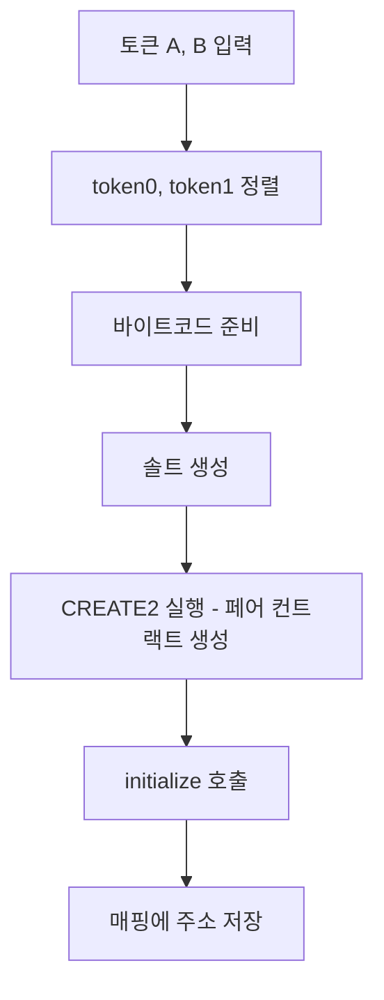

# uniswap v2 core contract 분석

uniswap v2 core 에는 크게 factory, pair 2개의 컨트랙트가 있다.

이 컨트랙트들을 코드를 까보며 보려고 한다.

# 1. Factory

factory 에서는 흔히 LP 라고 부르는 pair를 만든다.

그리고 프로토콜 수수료를 받을 주소를 저장하고 있는다.

눈여겨볼 함수는 createPair 이다.

프로세스는 다음과 같다.



다음은 코드이다.

```solidity
function createPair(address tokenA, address tokenB) external returns (address pair) {
    require(tokenA != tokenB, 'UniswapV2: IDENTICAL_ADDRESSES');
    (address token0, address token1) = tokenA < tokenB ? (tokenA, tokenB) : (tokenB, tokenA);
    require(token0 != address(0), 'UniswapV2: ZERO_ADDRESS');
    require(getPair[token0][token1] == address(0), 'UniswapV2: PAIR_EXISTS'); // single check is sufficient
    bytes memory bytecode = type(UniswapV2Pair).creationCode;
    bytes32 salt = keccak256(abi.encodePacked(token0, token1));
    assembly {
        pair := create2(0, add(bytecode, 32), mload(bytecode), salt)
    }
    IUniswapV2Pair(pair).initialize(token0, token1);
    getPair[token0][token1] = pair;
    getPair[token1][token0] = pair; // populate mapping in the reverse direction
    allPairs.push(pair);
    emit PairCreated(token0, token1, pair, allPairs.length);
}
```

상세히 라인별로 코드를 따라가 본다.

## (1) token0, token1 정렬

```solidity
(address token0, address token1) = tokenA < tokenB ? (tokenA, tokenB) : (tokenB, tokenA);
```

2개의 토큰 address를 받아서 pair를 만드는 것이다.

pair의 중복을 막기위해 token을 정렬한다.

다음은 실제 pair를 배포하는 코드이다

## (2) 바이트코드 준비

```solidity
bytes memory bytecode = type(UniswapV2Pair).creationCode;
```

먼저 pair의 배포에 필요한 바이트 코드의 메모리 주소를 가져온다.

바이트코드의 첫 32바이트에는 길이를 저장하고 나머지에 실제 데이터를 저장한다고 한다.

## (3) 솔트 생성

```solidity
bytes32 salt = keccak256(abi.encodePacked(token0, token1));
```

먼저 [solidity 공식문서에서 abi.encodePacked](https://docs.soliditylang.org/en/v0.8.30/abi-spec.html)에 대해 설명을 봤다.

abi.encode 와 abi.encodePacked 두가지가 있는데 abi.encodePacked는 압축으로 32바이트 미만 타입들은 패딩값을 안넣는다고 한다. 하지만 값이 배열일때는 패딩을 유지한다고 한다.

keccak256 함수는 solidity에서의 기본 해시함수이다. sha256등 [다른 해시함수들](https://www.geeksforgeeks.org/solidity/what-is-hashing-in-solidity/)보다 비교적 가스비가 덜든다고 한다.

```solidity
// 배열 요소는 32바이트로 패딩
uint16[2] memory arr = [uint16(0x12), uint16(0x34)];
abi.encodePacked(arr) = 0x00120034
```

salt를 만들어서 create2 할 준비를 한다.

salt에 정렬된 token 주소들을 넣기 때문에 같은 token들을 넣으면 같은 값이 나온다.

## (4) CREATE2 실행

```solidity
assembly {
    pair := create2(0, add(bytecode, 32), mload(bytecode), salt)
}
```

[solidity 공식문서](https://solidity-kr.readthedocs.io/ko/latest/assembly.html)의 assembly create2의 설명을 보면 아래와 같은 설명이 있다.

```
create2(v, p, n, s)

create new contract with code mem[p...(p+n)) at address keccak256(0xff . this . s . keccak256(mem[p...(p+n))) and send v wei and return the new address, where 0xff is a 8 byte value, this is the current contract's address as a 20 byte value and s is a big-endian 256-bit value
```

위 설명은 잘 이해가 안됬는데 그나마 EIP-1014의 [CREATE2 OP CODE(0xF5)](https://ethervm.io/#F5)를 보면서 이해가 됐다.

`addr = new memory[offset:offset+length].value(value)`

create2 함수를 이해하기 위해선 컨트랙트의 바이트 코드의 구조를 이해해야 했다.

여기서 offset 은 bytecode의 실제 데이터가 시작되는 위치인 32바이트 뒤다.

length 는 mload(bytecode) 값인데 mload는 mem[p...(p+32))로 bytecode의 앞 32바이트 즉 길이에 대한 값이다.

참고로 pair contract에서는 호출자를 constructor에서 factory로 저장한다.

```solidity
constructor() public {
    factory = msg.sender;
}
```

## (5) initialize 호출

```solidity
IUniswapV2Pair(pair).initialize(token0, token1);
```

pair 컨트랙트에서 initialize 함수를 살펴보면 다음과 같다.

```solidity
// called once by the factory at time of deployment
function initialize(address _token0, address _token1) external {
    require(msg.sender == factory, 'UniswapV2: FORBIDDEN'); // sufficient check
    token0 = _token0;
    token1 = _token1;
}
```

factory에서 호출한게 아니라면 revert 시키고 각 token들을 변수에 할당시킨다.

## (6) 매핑에 주소 저장

```solidity
getPair[token0][token1] = pair;
getPair[token1][token0] = pair;
```

factory에 token들의 주소를 저장시킨다.

# 2. Pair

pair 컨트랙트에는 유동성 넣고 빼기, 스왑 기능이 있다. Pair는 LP pool 이라고 생각하면 된다.

## (1) mint

LP token을 mint 하는 함수이다. 여기서부터 조금 복잡해진다. 마찬가지로 차근차근 분석해보려고 한다.

```solidity
function mint(address to) external lock returns (uint liquidity) {
    (uint112 _reserve0, uint112 _reserve1,) = getReserves(); // gas savings
    uint balance0 = IERC20(token0).balanceOf(address(this));
    uint balance1 = IERC20(token1).balanceOf(address(this));
    uint amount0 = balance0.sub(_reserve0);
    uint amount1 = balance1.sub(_reserve1);

    bool feeOn = _mintFee(_reserve0, _reserve1);
    uint _totalSupply = totalSupply; // gas savings, must be defined here since totalSupply can update in _mintFee
    if (_totalSupply == 0) {
        liquidity = Math.sqrt(amount0.mul(amount1)).sub(MINIMUM_LIQUIDITY);
        _mint(address(0), MINIMUM_LIQUIDITY); // permanently lock the first MINIMUM_LIQUIDITY tokens
    } else {
        liquidity = Math.min(amount0.mul(_totalSupply) / _reserve0, amount1.mul(_totalSupply) / _reserve1);
    }
    require(liquidity > 0, 'UniswapV2: INSUFFICIENT_LIQUIDITY_MINTED');
    _mint(to, liquidity);

    _update(balance0, balance1, _reserve0, _reserve1);
    if (feeOn) kLast = uint(reserve0).mul(reserve1); // reserve0 and reserve1 are up-to-date
    emit Mint(msg.sender, amount0, amount1);
}
```

먼저 getReserves 함수부터 보면 다음과 같다.

```solidity
function getReserves() public view returns (uint112 _reserve0, uint112 _reserve1, uint32 _blockTimestampLast) {
    _reserve0 = reserve0;
    _reserve1 = reserve1;
    _blockTimestampLast = blockTimestampLast;
}
```

뜬금없는 uint112가 나오는데 가스비 최적화를 위한 값이다.

storage 의 한 슬롯은 256비트로 구성되는데 112, 112, 32 를 모두 더하면 256비트가 되기 때문에 슬롯 1개만을 사용하여 가스비를 절약할 수 있다.

reserve0 과 reserve1은 예외가 있긴 하지만 전에 이 컨트랙트가 들고있던 token0과 token1의 개수라고 생각하면 편했다.

정확히는 마지막으로 업데이트된 token0과 token1의 개수이다. mint, burn, swap, sync 함수가 실행될때 업데이트 된다.

업데이트 안되어있으면 초기값은 0이다.

그다음은 이 컨트랙트가 가지고 있는 실제 토큰들의 개수를 구한다.

```solidity
uint balance0 = IERC20(token0).balanceOf(address(this));
uint balance1 = IERC20(token1).balanceOf(address(this));
```

이 실제 밸런스에서 전에 가지고 있던 토큰의 개수를 뺀다

```solidity
uint amount0 = balance0.sub(_reserve0);
uint amount1 = balance1.sub(_reserve1);
```

그다음 mintFee를 계산한다.

mintFee는 프로토콜 수수료인데 uniswap v2 whitepaper에서 2.4 Protocol fee 부분을 참고했다.

```solidity
bool feeOn = _mintFee(_reserve0, _reserve1);

// if fee is on, mint liquidity equivalent to 1/6th of the growth in sqrt(k)
function _mintFee(uint112 _reserve0, uint112 _reserve1) private returns (bool feeOn) {
    address feeTo = IUniswapV2Factory(factory).feeTo();
    feeOn = feeTo != address(0);
    uint _kLast = kLast; // gas savings
    if (feeOn) {
        if (_kLast != 0) {
            uint rootK = Math.sqrt(uint(_reserve0).mul(_reserve1));
            uint rootKLast = Math.sqrt(_kLast);
            if (rootK > rootKLast) {
                uint numerator = totalSupply.mul(rootK.sub(rootKLast));
                uint denominator = rootK.mul(5).add(rootKLast);
                uint liquidity = numerator / denominator;
                if (liquidity > 0) _mint(feeTo, liquidity);
            }
        }
    } else if (_kLast != 0) {
        kLast = 0;
    }
}
```

factory 컨트랙트에 feeTo가 설정되어있다면 가져온다. 이 feeTo 주소는 프로토콜의 수수료라고 생각하면 된다.

```solidity
address feeTo = IUniswapV2Factory(factory).feeTo();
feeOn = feeTo != address(0);
```

다음은 좀 복잡한 부분을 보겠다. feeTo 가 있는 경우 어떻게 수수료를 챙기는지의 부분이다.

```solidity
if (_kLast != 0)
```

\_kLast는 이전 거래 후의 k값 (reserve0 x reserve1)을 저장한다.

초기 상태에서는 kLast = 0 이므로 수수료를 계산할 기준점이 없다.

마찬가지로 feeTo를 초기에 설정안했다가 중간에 설정하는 경우 feeTo를 설정한 시점 전까지는 수수료를 계산하지 않는다.

```solidity
uint rootK = Math.sqrt(uint(_reserve0).mul(_reserve1));
uint rootKLast = Math.sqrt(_kLast);
```

\_reserve0 와 \_reserve1의 값은 swap 함수에서 update를 하는데 rootK 가 rootKLast보다 증가했다는 말은 전체 유동성 풀의 가치가 증가했다는 말이다.

참고로 위에있던 kLast변수 할당은 mint와 burn 에서만 적용한다.

```solidity
uint _kLast = kLast;
```

왜냐하면 매번 swap할때마다 프로토콜에 수수료를 지급하는것보다 모아서 mint나 burn 할때 한번에 수수료를 받기 위해서라고 한다.

다음은 uniswap v2 whitepaper 에서 수수료를 한번에 받는것과 관련된 문장이다.

```
Collecting this 0.05% fee at the time of the trade would impose an additional gas cost on
every trade. To avoid this, accumulated fees are collected only when liquidity is deposited
or withdrawn.
```

다음은 fee를 걷어가는 수학 공식을 코드로 표현했다.

```solidity
if (rootK > rootKLast) {
    uint numerator = totalSupply.mul(rootK.sub(rootKLast));
    uint denominator = rootK.mul(5).add(rootKLast);
    uint liquidity = numerator / denominator;
    if (liquidity > 0) _mint(feeTo, liquidity);
}
```

white paper를 보고 공식을 차근차근 봐보겠다.

$$f_{1,2} = 1 - \frac{\sqrt{k_1}}{\sqrt{k_2}}$$

$$\sqrt{k_1} = rootKLast$$

$$\sqrt{k_2} = rootK$$

$$\frac{\sqrt{k_1}}{\sqrt{k_2}} = 현재 \;상태 \;대비 \;이전 \;상태의 \;비율$$

$$f_{1,2} = 1 - \frac{\sqrt{k_1}}{\sqrt{k_2}} = 증가한 \;부분의 \;비율$$

우선 증가한 부분의 비율을 구한다.

feeTo가 설정되어있다면 수수료의 $\frac{1}{6}$을 프로토콜 수수료로 가져간다고 되어있다.

```
If the feeTo address is set, the protocol will begin charging a 5-basis-point fee, which is taken as a 1/6 cut of the 30-basis-point fees earned by liquidity providers
```

수수료는 LP 토큰을 민팅하는 방식으로 수집된다.

증가한 부분 비율의 $\frac{1}{6}$만큼 새로운 LP 토큰을 프로토콜에게 민팅한다.

$$
s_m = 민팅 토큰의 양\\
s_1 = total \;supply\\
φ = \frac{1}{6}
$$

$$φ \times f_{1,2} = \frac{s_m}{s_m + s_1}$$

전체중 민팅토큰의 양의 비율이 k값의 증가 비율의 1/6 이랑 같다.

우리가 구하려는건 수수료로 민팅할 개수인 $s_m$이다.

식을 정리해보면 다음과 같이 된다.

$$(φ \times f_{1,2})({s_m + s_1})= s_m$$

$$(φ \times f_{1,2})s_m + (φ \times f_{1,2}){s_1}= s_m$$

$$(φ \times f_{1,2}){s_1}= s_m - (φ \times f_{1,2})s_m$$

$$(φ \times f_{1,2}){s_1}= s_m(1- φ \times f_{1,2})$$

$$\frac{(φ \times f_{1,2}){s_1}}{(1- φ \times f_{1,2})}= s_m$$

$φ = \frac{1}{6}, f_{1,2} = 1 - \frac{\sqrt{k_1}}{\sqrt{k_2}}$ 를 대입해보면 아래와 같이 식이 만들어진다.

$$\frac{(\frac{1}{6} \times (1 - \frac{\sqrt{k_1}}{\sqrt{k_2}})){s_1}}{(1- \frac{1}{6} \times (1 - \frac{\sqrt{k_1}}{\sqrt{k_2}}))}= s_m$$

$$\frac{(\frac{1}{6} - \frac{1}{6}\frac{\sqrt{k_1}}{\sqrt{k_2}}){s_1}}{(1- (\frac{1}{6} - \frac{1}{6}\frac{\sqrt{k_1}}{\sqrt{k_2}}))}= s_m$$

$$\frac{(\frac{1}{6} - \frac{1}{6}\frac{\sqrt{k_1}}{\sqrt{k_2}}){s_1}}{(\frac{5}{6} + \frac{1}{6}\frac{\sqrt{k_1}}{\sqrt{k_2}})}= s_m$$

왼쪽 분수에 분자, 분모에 각각 $6\sqrt{k_2}$ 를 곱해주면 다음과 같이 정리된다.

$$\frac{(\sqrt{k_2} - \sqrt{k_1}){s_1}}{5\sqrt{k_2} + \sqrt{k_1}}= s_m$$

그러면 $s_m$ 은 위코드에서 계산한 값과 똑같이 계산되는걸 볼수 있다.

```solidity
uint numerator = totalSupply.mul(rootK.sub(rootKLast));
uint denominator = rootK.mul(5).add(rootKLast);
uint liquidity = numerator / denominator;
```

`uint liquidity = numerator / denominator;` 에서 uint는 소수점을 허용하지 때문에 liquidity는 1이상인 값이 나와야한다.

다른 말로 바꿔보면 k값이 커져도 totalSupply 가 크지 않다면 수수료를 민팅하지 않는다는 것이다.

```solidity
if (liquidity > 0) _mint(feeTo, liquidity);
```

```solidity
function _mint(address to, uint value) internal {
    totalSupply = totalSupply.add(value);
    balanceOf[to] = balanceOf[to].add(value);
    emit Transfer(address(0), to, value);
}
```

다음은 feeTo가 설정되지 않은 조건을 보겠다.

```solidity
else if (_kLast != 0) {
    kLast = 0;
}
```

지금은 feeTo가 없지만 이전에는 있었다는 뜻이다.

그래서 다음에 다시 feeTo를 설정할때 같은 로직을 적용하기 위해 kLast를 0으로 값을 넣는다.

mint 함수를 마저 본다면 바뀐 totalSupply를 적용하고 totalSupply에 따라서 조건을 나눈다.

```solidity
uint _totalSupply = totalSupply; // gas savings, must be defined here since totalSupply can update in _mintFee
```

먼저 SLOAD라는 스토리지에서 읽는 op code를 실행할때 비용을 아끼기 위해 \_totalSupply라는 변수에 totalSupply를 넣는다. 추가로 위의 \_mintFee에서 totalSupply가 바뀔수 있기때문이라고도 한다.

그 다음은 totalSupply가 0인지 아닌지에 따라서 조건문을 탄다.

```solidity
if (_totalSupply == 0) {
    liquidity = Math.sqrt(amount0.mul(amount1)).sub(MINIMUM_LIQUIDITY);
    _mint(address(0), MINIMUM_LIQUIDITY); // permanently lock the first MINIMUM_LIQUIDITY tokens
} else {
    liquidity = Math.min(amount0.mul(_totalSupply) / _reserve0, amount1.mul(_totalSupply) / _reserve1);
}
```

totalSupply가 0이라면 1000wei 만큼 유동성을 address(0)으로 보낸다.

이렇게 되면 1000wei가 이미 민팅되었으니 1wei를 과도하게 비싸게 만들려면 꽤 많은 금액이 들어가야한다. 동시에 totalSupply가 다시 0이 되는걸 방지한다.

처음 mint를 실행한 경우이기때문에 유저가 가져갈 LP 토큰은 다음과 같이 계산된다.

$$s_{minted} = \sqrt{x_{deposited} \times y_{deposited}} - 1000$$

이는 초기에 넣은 x, y 값의 비율에 의존하기 위함이다.

totalSupply가 0이 아니라면 두값중 작은값을 선택한다.

$$\frac{amount0 \times totalSupply}{reserve0}\; or\; \frac{amount1 \times totalSupply}{reserve1}$$

token0 이 늘어난 비율과 token1이 늘어난 비율 중 작은값 만큼 totalSupply에서 민팅한다는 것이다.

왜 더 작은값을 선택해야하는지 아래에 예시를 들겠다.

```
현재 : 10ETH, 40,000USDT  1ETH/4000USDT
추가 : 1ETH, 2,000USDT    1ETH/2000USDT
totalSupply = 1000 개라고 한다면

amount0 x totalSupply / reserve0 = 1 x 1000 / 10 = 100
amount1 x totalSupply / reserve1 = 2000 x 1000 / 40000 = 50

ETH 기준 계산으론 100개 민팅
USDT 기준 계산으론 50개 민팅

즉 더 작은값을 선택하여 공정성과 일관성을 유지하는것이다.
```

다음은 선택한 liquidity 값이 0 이상인지 확인 후 민팅한다

```solidity
require(liquidity > 0, 'UniswapV2: INSUFFICIENT_LIQUIDITY_MINTED');
_mint(to, liquidity);
```

민팅 후 실제 balance를 reserve에 업데이트 한다.

```solidity
_update(balance0, balance1, _reserve0, _reserve1);
```

\_update 함수를 들여다 보면 다음과 같다.

```solidity
// update reserves and, on the first call per block, price accumulators
function _update(uint balance0, uint balance1, uint112 _reserve0, uint112 _reserve1) private {
    require(balance0 <= uint112(-1) && balance1 <= uint112(-1), 'UniswapV2: OVERFLOW');
    uint32 blockTimestamp = uint32(block.timestamp % 2**32);
    uint32 timeElapsed = blockTimestamp - blockTimestampLast; // overflow is desired
    if (timeElapsed > 0 && _reserve0 != 0 && _reserve1 != 0) {
        // * never overflows, and + overflow is desired
        price0CumulativeLast += uint(UQ112x112.encode(_reserve1).uqdiv(_reserve0)) * timeElapsed;
        price1CumulativeLast += uint(UQ112x112.encode(_reserve0).uqdiv(_reserve1)) * timeElapsed;
    }
    reserve0 = uint112(balance0);
    reserve1 = uint112(balance1);
    blockTimestampLast = blockTimestamp;
    emit Sync(reserve0, reserve1);
}
```

요것도 찬찬히 보겠다.

```solidity
require(balance0 <= uint112(-1) && balance1 <= uint112(-1), 'UniswapV2: OVERFLOW');
uint32 blockTimestamp = uint32(block.timestamp % 2**32);
uint32 timeElapsed = blockTimestamp - blockTimestampLast; // overflow is desired
```

balance들이 112비트로 표시할수 있는 값인지 먼저 체크하고 32비트 기반으로 timestamp를 계산한다.

```solidity
if (timeElapsed > 0 && _reserve0 != 0 && _reserve1 != 0) {
    // * never overflows, and + overflow is desired
    price0CumulativeLast += uint(UQ112x112.encode(_reserve1).uqdiv(_reserve0)) * timeElapsed;
    price1CumulativeLast += uint(UQ112x112.encode(_reserve0).uqdiv(_reserve1)) * timeElapsed;
}
```

이 부분은 가격 계산을 위한 값이다.

소수점의 오차를 줄이기 위해 UQ112x112 라이브러리를 사용해서 2^112 를 곱한값으로 사용한다.

타임스탬프가 32비트이므로 256비트기준으로 224비트가 남는다.

$2^{112} \times 2^{112} = 2^{224}$ 이므로 112비트인 reserve 값을 224 비트로 표현해서 소수점의 오차를 줄이는 것이다.

```solidity
reserve0 = uint112(balance0);
reserve1 = uint112(balance1);
blockTimestampLast = blockTimestamp;
emit Sync(reserve0, reserve1);
```

파라미터로 넣은 값들을 컨트랙트 스토어에 저장한다.

다시 mint 함수로 돌아와서

```solidity
if (feeOn) kLast = uint(reserve0).mul(reserve1); // reserve0 and reserve1 are up-to-date
```

feeOn 이 true 라면 kLast 를 컨트랙트 스토어에 저장한다.

마지막으로 Mint event를 발생시킨다.

```solidity
emit Mint(msg.sender, amount0, amount1);
```

## (2) burn

mint를 다 봤으면 burn을 그나마 수월하다.

```solidity
function burn(address to) external lock returns (uint amount0, uint amount1) {
    (uint112 _reserve0, uint112 _reserve1,) = getReserves(); // gas savings
    address _token0 = token0;                                // gas savings
    address _token1 = token1;                                // gas savings
    uint balance0 = IERC20(_token0).balanceOf(address(this));
    uint balance1 = IERC20(_token1).balanceOf(address(this));
    uint liquidity = balanceOf[address(this)];

    bool feeOn = _mintFee(_reserve0, _reserve1);
    uint _totalSupply = totalSupply; // gas savings, must be defined here since totalSupply can update in _mintFee
    amount0 = liquidity.mul(balance0) / _totalSupply; // using balances ensures pro-rata distribution
    amount1 = liquidity.mul(balance1) / _totalSupply; // using balances ensures pro-rata distribution
    require(amount0 > 0 && amount1 > 0, 'UniswapV2: INSUFFICIENT_LIQUIDITY_BURNED');
    _burn(address(this), liquidity);
    _safeTransfer(_token0, to, amount0);
    _safeTransfer(_token1, to, amount1);
    balance0 = IERC20(_token0).balanceOf(address(this));
    balance1 = IERC20(_token1).balanceOf(address(this));

    _update(balance0, balance1, _reserve0, _reserve1);
    if (feeOn) kLast = uint(reserve0).mul(reserve1); // reserve0 and reserve1 are up-to-date
    emit Burn(msg.sender, amount0, amount1, to);
}
```

이것도 차근차근 보면

```solidity
(uint112 _reserve0, uint112 _reserve1,) = getReserves(); // 이전까지 적용된 토큰의 개수를 받아오고
address _token0 = token0;
address _token1 = token1; // 토큰 컨트랙트 불러오고
uint balance0 = IERC20(_token0).balanceOf(address(this));
uint balance1 = IERC20(_token1).balanceOf(address(this)); // 실제 컨트랙트가 가지고 있는 수량을 가져온다.

uint liquidity = balanceOf[address(this)]; // 이 컨트랙트의 balance 를 가져오는데 burn 함수를 호출하기전에 이 컨트랙트에 토큰을 전송하는걸로 추측된다.

bool feeOn = _mintFee(_reserve0, _reserve1); // mint 함수와 마찬가지로 수수료를 챙긴다.
```

그다음은 liquidity 의 개수만큼 토큰을 받는 로직이다.

```solidity
uint _totalSupply = totalSupply; // gas savings, must be defined here since totalSupply can update in _mintFee
amount0 = liquidity.mul(balance0) / _totalSupply; // using balances ensures pro-rata distribution
amount1 = liquidity.mul(balance1) / _totalSupply; // using balances ensures pro-rata distribution
```

위 식은 실제 잔액에서 전체 발행된 liquidity 에서 burn 시키려는 liquidity의 비율만큼 각 토큰을 받는것이다.

그다음 liquidity 만큼의 토큰을 소각시키고 토큰0과 토큰1을 to에게 보내준다.

```solidity
_burn(address(this), liquidity);
_safeTransfer(_token0, to, amount0);
_safeTransfer(_token1, to, amount1);
```

그 뒤는 mint 와 동일하게 update 후 kLast를 업데이트 시켜준다.

```solidity
 _update(balance0, balance1, _reserve0, _reserve1);
if (feeOn) kLast = uint(reserve0).mul(reserve1); // reserve0 and reserve1 are up-to-date
emit Burn(msg.sender, amount0, amount1, to);
```

## (3) swap

swap 함수는 토큰을 교환하는 핵심 함수이다. Uniswap V2의 AMM 메커니즘을 구현한 부분으로, constant product formula를 기반으로 거래를 실행한다.

```solidity
function swap(uint amount0Out, uint amount1Out, address to, bytes calldata data) external lock {
    require(amount0Out > 0 || amount1Out > 0, 'UniswapV2: INSUFFICIENT_OUTPUT_AMOUNT');
    (uint112 _reserve0, uint112 _reserve1,) = getReserves(); // gas savings
    require(amount0Out < _reserve0 && amount1Out < _reserve1, 'UniswapV2: INSUFFICIENT_LIQUIDITY');

    uint balance0;
    uint balance1;
    { // scope for _token{0,1}, avoids stack too deep errors
    address _token0 = token0;
    address _token1 = token1;
    require(to != _token0 && to != _token1, 'UniswapV2: INVALID_TO');
    if (amount0Out > 0) _safeTransfer(_token0, to, amount0Out); // optimistically transfer tokens
    if (amount1Out > 0) _safeTransfer(_token1, to, amount1Out); // optimistically transfer tokens
    if (data.length > 0) IUniswapV2Callee(to).uniswapV2Call(msg.sender, amount0Out, amount1Out, data);
    balance0 = IERC20(_token0).balanceOf(address(this));
    balance1 = IERC20(_token1).balanceOf(address(this));
    }
    uint amount0In = balance0 > _reserve0 - amount0Out ? balance0 - (_reserve0 - amount0Out) : 0;
    uint amount1In = balance1 > _reserve1 - amount1Out ? balance1 - (_reserve1 - amount1Out) : 0;
    require(amount0In > 0 || amount1In > 0, 'UniswapV2: INSUFFICIENT_INPUT_AMOUNT');
    { // scope for reserve{0,1}Adjusted, avoids stack too deep errors
    uint balance0Adjusted = balance0.mul(1000).sub(amount0In.mul(3));
    uint balance1Adjusted = balance1.mul(1000).sub(amount1In.mul(3));
    require(balance0Adjusted.mul(balance1Adjusted) >= uint(_reserve0).mul(_reserve1).mul(1000**2), 'UniswapV2: K');
    }

    _update(balance0, balance1, _reserve0, _reserve1);
    emit Swap(msg.sender, amount0In, amount1In, amount0Out, amount1Out, to);
}
```

차근차근 분석해보겠다.

### (1) 기본 검증

```solidity
require(amount0Out > 0 || amount1Out > 0, 'UniswapV2: INSUFFICIENT_OUTPUT_AMOUNT');
(uint112 _reserve0, uint112 _reserve1,) = getReserves(); // gas savings
require(amount0Out < _reserve0 && amount1Out < _reserve1, 'UniswapV2: INSUFFICIENT_LIQUIDITY');
```

첫 번째 검증은 출력 토큰 중 하나라도 0보다 큰지 확인한다. 두 번째는 이전에 설명한 getReserves 함수를 사용해서 현재 리저브를 가져온다. 마지막으로 출력 토큰 양이 리저브보다 작은지 확인한다. 이는 유동성이 충분한지 확인하는 검증이다.

### (2) Optimistic Transfer와 Flash Swap

```solidity
{ // scope for _token{0,1}, avoids stack too deep errors
address _token0 = token0;
address _token1 = token1;
require(to != _token0 && to != _token1, 'UniswapV2: INVALID_TO');
if (amount0Out > 0) _safeTransfer(_token0, to, amount0Out); // optimistically transfer tokens
if (amount1Out > 0) _safeTransfer(_token1, to, amount1Out); // optimistically transfer tokens
if (data.length > 0) IUniswapV2Callee(to).uniswapV2Call(msg.sender, amount0Out, amount1Out, data);
balance0 = IERC20(_token0).balanceOf(address(this));
balance1 = IERC20(_token1).balanceOf(address(this));
}
```

이 부분은 Uniswap V2의 핵심 특징 중 하나인 **Flash Swap** 기능을 구현한 부분이다.

먼저 토큰 주소를 로컬 변수에 저장한다. 이는 가스 절약과 스택 깊이 제한 회피를 위한 최적화이다.

```solidity
require(to != _token0 && to != _token1, 'UniswapV2: INVALID_TO');
```

이 검증은 토큰이 자기 자신에게 전송되는 것을 방지한다.

```solidity
if (amount0Out > 0) _safeTransfer(_token0, to, amount0Out);
if (amount1Out > 0) _safeTransfer(_token1, to, amount1Out);
```

**Optimistic Transfer**라고 불리는 이 방식은 입력 토큰을 받기 전에 출력 토큰을 먼저 전송한다.

왜 이렇게 설계했냐면 Flash Swap을 지원하기 위해서이다. Flash Swap은 사용자가 출력 토큰을 먼저 받아서 다른 작업을 수행한 후, 나중에 입력 토큰을 반환하는 메커니즘이다.

```solidity
if (data.length > 0) IUniswapV2Callee(to).uniswapV2Call(msg.sender, amount0Out, amount1Out, data);
```

만약 `data.length > 0`이면, `to` 주소가 `IUniswapV2Callee` 인터페이스를 구현한 컨트랙트라는 의미이다. 이 경우 `uniswapV2Call` 함수를 호출하여 Flash Swap을 실행한다.

**Flash Swap 사용 예시:**

1. 사용자가 DAI를 받고 싶지만 가지고 있지 않음
2. Flash Swap으로 DAI를 먼저 받음
3. 받은 DAI로 다른 거래 수행
4. 그 거래의 수익으로 ETH를 얻음
5. ETH를 Uniswap에 반환하여 DAI 대금 지불

이렇게 하면 자본 없이도 거래가 가능하다.

전송 후 실제 잔액을 확인한다:

```solidity
balance0 = IERC20(_token0).balanceOf(address(this));
balance1 = IERC20(_token1).balanceOf(address(this));
```

### (3) 실제 입력량 계산

```solidity
uint amount0In = balance0 > _reserve0 - amount0Out ? balance0 - (_reserve0 - amount0Out) : 0;
uint amount1In = balance1 > _reserve1 - amount1Out ? balance1 - (_reserve1 - amount1Out) : 0;
require(amount0In > 0 || amount1In > 0, 'UniswapV2: INSUFFICIENT_INPUT_AMOUNT');
```

이 부분은 실제로 입력된 토큰 양을 계산한다.

- `_reserve0 - amount0Out`: 출력 후 예상 리저브
- `balance0 > _reserve0 - amount0Out`: 실제 잔액이 예상 리저브보다 큰지 확인
- `balance0 - (_reserve0 - amount0Out)`: 차이만큼이 입력량

### (4) K 값 검증 (Constant Product Formula with Fees)

```solidity
{ // scope for reserve{0,1}Adjusted, avoids stack too deep errors
uint balance0Adjusted = balance0.mul(1000).sub(amount0In.mul(3));
uint balance1Adjusted = balance1.mul(1000).sub(amount1In.mul(3));
require(balance0Adjusted.mul(balance1Adjusted) >= uint(_reserve0).mul(_reserve1).mul(1000**2), 'UniswapV2: K');
}
```

이 부분은 Uniswap V2의 핵심인 **Constant Product Formula**를 수수료를 포함하여 검증하는 부분이다.

**Uniswap V2의 수수료:**

- 거래당 0.3% (30 basis points)
- 이 중 0.05% (5 basis points)는 프로토콜 수수료 (feeTo가 설정된 경우)

이를 수식으로 표현하면:
$$balance_{adjusted} = balance \times 1000 - amountIn \times 3$$
$$= balance \times 1000 - amountIn \times (1000 \times 0.003)$$

실제 검증 공식:
$$balance0_{adjusted} \times balance1_{adjusted} \geq reserve0 \times reserve1 \times 1000^2$$

이를 풀어쓰면:
$$(balance0 \times 1000 - amount0In \times 3) \times (balance1 \times 1000 - amount1In \times 3) \geq reserve0 \times reserve1 \times 1000^2$$

양변을 1000²로 나누면:
$$\frac{balance0 \times 1000 - amount0In \times 3}{1000} \times \frac{balance1 \times 1000 - amount1In \times 3}{1000} \geq reserve0 \times reserve1$$

$$(balance0 - \frac{amount0In \times 3}{1000}) \times (balance1 - \frac{amount1In \times 3}{1000}) \geq reserve0 \times reserve1$$

$$(balance0 - amount0In \times 0.003) \times (balance1 - amount1In \times 0.003) \geq reserve0 \times reserve1$$

즉, 수수료(0.3%)를 뺀 후에도 K 값이 유지되거나 증가해야 한다는 의미이다.

- 수수료(0.3%)를 제외한 후의 K 값이 이전 K 값보다 크거나 같아야 함
- 이는 수수료가 제대로 적용되었는지 확인하는 검증이다

### (5) 리저브 업데이트

```solidity
_update(balance0, balance1, _reserve0, _reserve1);
emit Swap(msg.sender, amount0In, amount1In, amount0Out, amount1Out, to);
```

검증을 통과하면 `_update` 함수를 호출하여 리저브를 업데이트하고 가격 누적값도 업데이트한다. 마지막으로 Swap 이벤트를 발생시켜 거래를 기록한다.

**Swap 함수의 전체 흐름:**

1. 입력 검증 (출력량, 유동성 확인)
2. Optimistic Transfer (출력 토큰 먼저 전송)
3. Flash Swap 콜백 (필요한 경우)
4. 실제 입력량 계산
5. K 값 검증 (수수료 포함)
6. 리저브 업데이트
7. 이벤트 발생

마지막으로 예시를 보면 아래와 같다.

```
1. 사용자가 swap 함수 호출
   └─ amount0Out = 0
   └─ amount1Out = 1000 DAI
   └─ to = MyContract (Flash Swap을 수행할 컨트랙트)
   └─ data = "arbitrage_data" (다른 거래에 필요한 정보)

2. Uniswap Pair가 DAI 전송
   └─ _safeTransfer(DAI, MyContract, 1000)
   └─ Pair 잔액: DAI가 1000 감소

3. uniswapV2Call 콜백 실행
   └─ MyContract.uniswapV2Call() 실행
   └─ 이 함수 내부에서:
      a) 받은 1000 DAI로 다른 거래 수행
      b) 예: 다른 DEX에서 ETH 구매
      c) 그 ETH를 판매하여 DAI + 수익 확보
      d) Uniswap에 지불할 ETH 계산 및 전송

4. balance 확인
   └─ balance0 = IERC20(ETH).balanceOf(Pair)
   └─ balance1 = IERC20(DAI).balanceOf(Pair)
   └─ 만약 MyContract가 ETH를 제대로 전송했다면:
      balance0 = 이전 + 지불할_ETH
      balance1 = 이전 - 1000 (이미 전송됨)

5. 입력량 계산
   └─ amount0In = balance0 - (_reserve0 - 0)
   └─ = 지불한_ETH_양

6. K 값 검증
   └─ 수수료를 포함한 K 값이 유지되는지 확인
   └─ 실패하면 전체 트랜잭션 revert
```

## reference

[uniswap v2 core](https://github.com/Uniswap/v2-core)

[uniswap v2 whitepaper](https://app.uniswap.org/whitepaper.pdf)

[solidity 공식문서](https://docs.soliditylang.org)

[ethervm](https://ethervm.io/#F5)

[What is Hashing in Solidity?](https://www.geeksforgeeks.org/solidity/what-is-hashing-in-solidity/)
