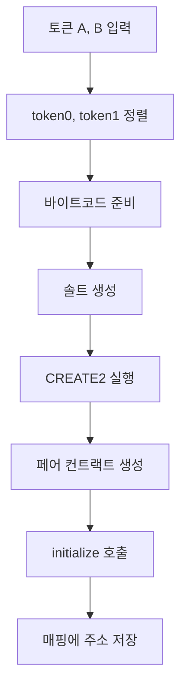

# uniswap v2 core contract 분석

uniswap v2 core 에는 크게 factory, pair 2개의 컨트랙트가 있다.

이 컨트랙트들을 코드를 까보며 보려고 한다.

## (1) Factory

factory 에서는 흔히 LP 라고 부르는 pair를 만든다.

그리고 프로토콜 수수료를 받을 주소를 저장하고 있는다.

눈여겨볼 함수는 createPair 이다.

프로세스는 다음과 같다.



다음은 코드이다.

```solidity
function createPair(address tokenA, address tokenB) external returns (address pair) {
    require(tokenA != tokenB, 'UniswapV2: IDENTICAL_ADDRESSES');
    (address token0, address token1) = tokenA < tokenB ? (tokenA, tokenB) : (tokenB, tokenA);
    require(token0 != address(0), 'UniswapV2: ZERO_ADDRESS');
    require(getPair[token0][token1] == address(0), 'UniswapV2: PAIR_EXISTS'); // single check is sufficient
    bytes memory bytecode = type(UniswapV2Pair).creationCode;
    bytes32 salt = keccak256(abi.encodePacked(token0, token1));
    assembly {
        pair := create2(0, add(bytecode, 32), mload(bytecode), salt)
    }
    IUniswapV2Pair(pair).initialize(token0, token1);
    getPair[token0][token1] = pair;
    getPair[token1][token0] = pair; // populate mapping in the reverse direction
    allPairs.push(pair);
    emit PairCreated(token0, token1, pair, allPairs.length);
}
```

상세히 라인별로 코드를 따라가 본다.

```solidity
(address token0, address token1) = tokenA < tokenB ? (tokenA, tokenB) : (tokenB, tokenA);
```

2개의 토큰 address를 받아서 pair를 만드는 것이다.

pair의 중복을 막기위해 token을 정렬한다.

다음은 실제 pair를 배포하는 코드이다

```solidity
bytes memory bytecode = type(UniswapV2Pair).creationCode;
```

먼저 pair의 배포에 필요한 바이트 코드를 가져온다.

```solidity
bytes32 salt = keccak256(abi.encodePacked(token0, token1));
```

salt를 만들어서 create2 할 준비를 한다.

salt에 정렬된 token 주소들을 넣기 때문에 같은 token들을 넣으면 같은 값이 나온다.

```solidity
assembly {
    pair := create2(0, add(bytecode, 32), mload(bytecode), salt)
}
```

[solidity 공식문서](https://solidity-kr.readthedocs.io/ko/latest/assembly.html)의 assembly create2의 설명을 보면 아래와 같은 설명이 있다.

```
create2(v, p, n, s)

create new contract with code mem[p...(p+n)) at address keccak256(0xff . this . s . keccak256(mem[p...(p+n))) and send v wei and return the new address, where 0xff is a 8 byte value, this is the current contract's address as a 20 byte value and s is a big-endian 256-bit value
```

keccak256에 들어가는 값들을 살펴본다면

- 0xff

  - CREATE2를 식별하는 고유 prefix 이다. (8바이트)

- this

  - 배포자(creator)를 식별하기 위한 값이다. (20비트)

- s

  - 고유성을 보장하기위한 32바이트 salt 값이다. (32바이트)

- keccak256(code)

  - 배포할 코드 (32바이트)
